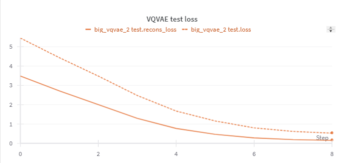
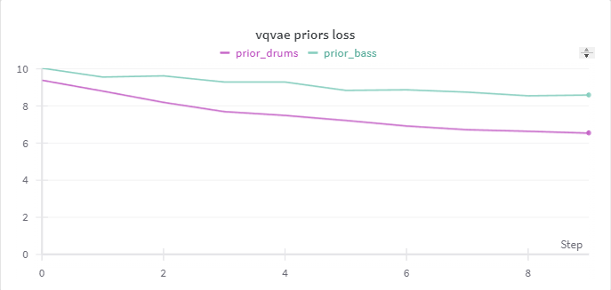
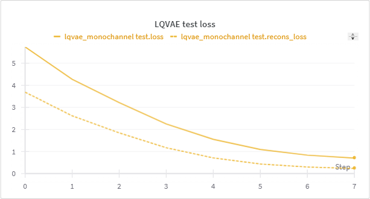
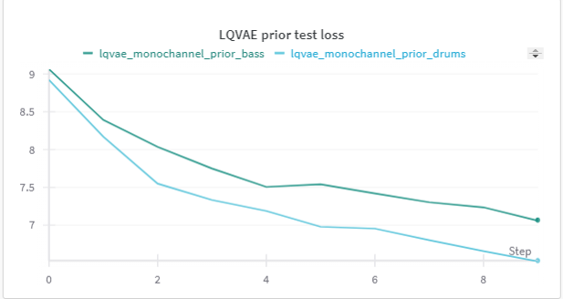

# DLAI_project_LQVAE_LASS_hybrid
An academic project to compare and combine LQVAE and LASS

## Problem statement
Current state-of-the-art generative audio source separation models
are either resource-intensive or impractical for use at inference time. The LQ-VAE and
LASS models both offer alternative solutions to these limitations, but it is unclear which
approach provides better separation performance. The goal of this project is to combine
the LQ-VAE and LASS methodologies, potentially trading the flexibility of LASS for
improved separation performance.

## Repository key points :key
The repository contains the code used to train and test the following models:
- **LASS** 

- **LQVAE**

- **Hybrid**

Most of the used code comes from the  following repositories:
- [LASS](https://github.com/gladia-research-group/latent-autoregressive-source-separation)
- [LQVAE](https://github.com/michelemancusi/LQVAE-separation)

## Main Code modification
A few modification were to be made in order for the code to run.

### General modification for all the models variants
- The option drop_last of the dataloader in the data_processor.py file in jukebox had to be set to True
- Wandb code in the train.py file in jukebox to record the training metrics during the epochs
- In audio_utils.py in jukebox/utils the statement n_seen < n_samples: had to be changed in while n_seen < n_samples and idx < len(dataset): which solves a crash issue as stated by [jukebox issue](https://github.com/openai/jukebox/issues)

### LASS code modification
- in separate.py few fixes to the beam search separator initializer, it is now clear which separated source is related to the original source
- in separate.py few changes on the beam search function, it now returns all the candidates of the beam search instead of the last one
- separate_topk.py has been added with few modification to make the topk separator work, in particular it now uses the likelihood object instead of the likelihood type
- in diba.py fixes related to the topk separator, it now clear the prior cache at the start of a new sample

### LQVAE code modification
- Added a new file called bayesian_test_new.py which is a modified bayesian_test.py but the data is handled with the same class as the one used in LASS 

### Hybrid code
To run the hybrid model I used essentially all of the code in LASS but changing the dir prior files with the LQVAE's priors and the make_models.py

## Test results

|Avg SDR| LQVAE  | LASS beam | LASS topk | hybrid beam | hybrid topk |
|:-:|--|--|--|--|--|
|Drums|2.90|0.66|1.75|1.79|3.23|
|Bass |2.80|0.12|1.69|1.16|2.87|

## WandB
WandB has been used to record the training phase of the model.
### LASS's VQVAE training

### LASS's priors training

### LQVAE's VAQVAE training

### LQVAE's priors

